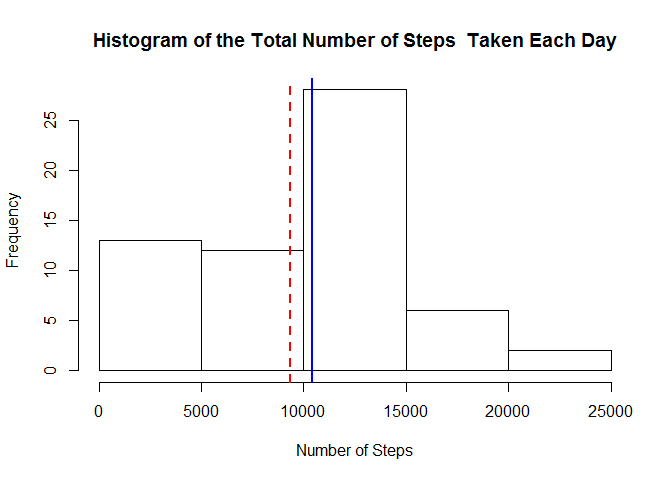
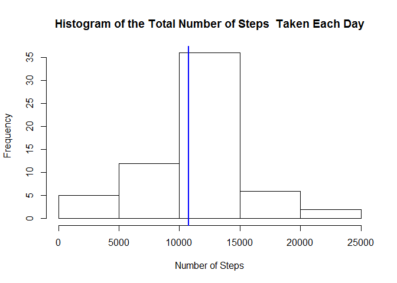

# Reproducible Research: Peer Assessment 1


## 1. Loading and preprocessing the data

1.1 Loading the data:


```r
    data <-read.csv(unz("activity.zip","activity.csv")) 
```

1.2 Transformation of the date variable:

```r
    data$date<-as.Date(data$date,"%Y-%m-%d") 
```

## 2. What is mean total number of steps taken per day?
The missing values in the data set is ignored for this part of the assignment.

2.1 Calculation of the total number of steps taken per day:


```r
    sub_data<-tapply(data$steps,data$date,sum,na.rm=TRUE)  
```

2.2 Histogram of the total number of steps taken each day:

```r
    hist(sub_data,xlab="Number of Steps",main="Histogram of the Total Number of Steps  Taken Each Day")
```

 

2.3 Calculation of the mean and median of the total number of steps taken per day:


```r
   mean<- mean(sub_data)  
   median <- median (sub_data)
```

    Mean of the total number of steps taken per day is 9354.  
    Median of the total number of steps taken per day is 10395.
    
 
 
## 3. What is the average daily activity pattern?

3.1 Time series plot of the 5-minute (x- axis) interval and the average number of steps taken,averaged across all days (y-axis):


```r
   sub_data_avg<- aggregate(list(steps=data$steps), list(interval=data$interval), mean, na.rm = TRUE)
   plot(x=sub_data_avg$interval,y=sub_data_avg$steps,type="l",main="Average Number of Steps by 5-Minute Intervals",xlab="5-Minute Intervals",ylab="Average Number of Steps")
```

 
  

3.2 8:35 5-minute interval, on average across all the days in the dataset, contains the maximum number of steps.
   

```r
   max(sub_data_avg$steps)
```

```
## [1] 206.1698
```
  
## 4. Imputing missing values
  
Note that there are 2304 of days/intervals where there are missing values (coded as NA). 

4.1 Calculation of the total number of missing values in the dataset:

```r
   length(data$steps[is.na(data$steps)==TRUE])
```

```
## [1] 2304
```

4.2  The averaged steps per interval (over all days) for filling in all of the missing values in the dataset. 

```r
   str(sub_data_avg)
```

```
## 'data.frame':	288 obs. of  2 variables:
##  $ interval: int  0 5 10 15 20 25 30 35 40 45 ...
##  $ steps   : num  1.717 0.3396 0.1321 0.1509 0.0755 ...
```

4.3  Creation of the new column in the dataset that is equal to the original dataset but with the missing data filled in:
  

```r
    dataFilled<-data
    ## in a loop, find all occurrences of NA in the dataset
    for (i in 1:nrow(data)){
        if (is.na(data[i,"steps"])){
            temp<-data[i,"interval"]
            ## fill in mean for specific interval for NAs
            dataFilled[i, "steps"]<- sub_data_avg[sub_data_avg$interval==temp,2]
        }
    }
```

4.4  Histogram of the total number of steps taken each day with the filled NA values:


```r
   sub_data2<-tapply(dataFilled$steps,dataFilled$date,sum,na.rm=TRUE) 
   mean2<- mean(sub_data2)  
   median2 <- median (sub_data2)
   hist(sub_data2,xlab="Number of Steps",main="Histogram of the Total Number of Steps  Taken Each Day")  
   abline(v=mean2,lty=2,lwd=2,col="red")  
   abline(v=median2,lwd=2,col="blue")
```

 


Mean of the total number of steps taken per day is 10766 (different than the mean value calculated with missing values 9354).

Median of the total number of steps taken per day is 10766 (different than the median value calculated with missing values 10395).

## 5. Are there differences in activity patterns between weekdays and weekends?

5.1 Creation of the new factor variable (is_weekend) in the dataset with two levels – “weekday” and “weekend” indicating whether a given date is a weekday or weekend day:


```r
    Sys.setlocale("LC_TIME", "English")  ## To obtain English names of days
```

```
## [1] "English_United States.1252"
```

```r
    dataFilled$hs <- as.factor(ifelse(weekdays(as.POSIXct(dataFilled$date))
                                        %in% c("Saturday", "Sunday"), "weekend", "weekday"))
```


5.2 Make a panel plot containing a time series plot (i.e. type = "l") of the 5-minute interval (x-axis) and the average number of steps taken, averaged across all weekday days or weekend days (y-axis). See the README file in the GitHub repository to see an example of what this plot should look like using simulated data.


```r
    dataFilled$hs <- factor(dataFilled$hs, levels = c("weekday", "weekend"))
    sub_data_avg2 <- aggregate(dataFilled$steps,list(interval=dataFilled$interval,hs=dataFilled$hs), mean)
    names(sub_data_avg2)<-c("interval","hs","steps")
    library(lattice)
```

```
## Warning: package 'lattice' was built under R version 3.2.2
```

```r
    xyplot(steps ~ interval | factor(hs), data = sub_data_avg2, 
           type = "l",
           xlab="Interval", ylab="Number of Steps",aspect=1/2)
```

 
  
    
